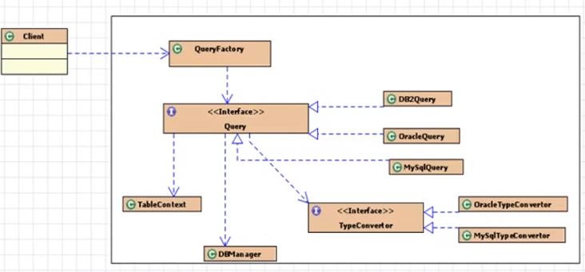

###框架学习 - 手写ORM

#### 找到jar包的位置
```
sudo apt-get install mysql-connector-java
dpkg -L mysql-connector-java
```



1. 在src下建立db.properties

2. 数据库
```$xslt
create database sorm;
use sorm;

drop table dept;
create table dept(
    id int(10) not null primary key auto_increment,
    address varchar(30) default null,
    dname varchar(100) default null
);

insert into dept (address, dname) values ("郭守敬路498号", "浦东软件园");

drop table emp;
create table emp
(
    id       int(10) not null primary key auto_increment,
    emplname varchar(20) default null,
    salary   double      default 0,
    birthday date,
    age      int(11)     default 0,
    depid    int(10) not null
);

show databases ;
show tables ;
```

最后,感谢北京尚学堂高淇老师的视频